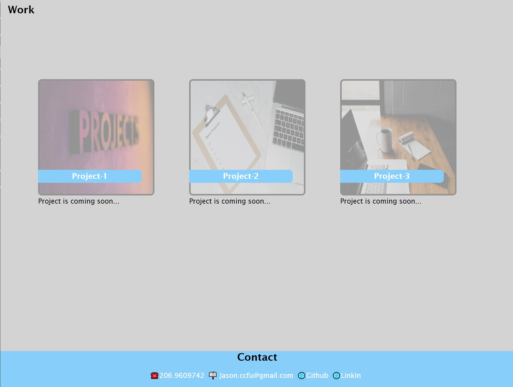

# <Portfolio>

## Description

As a web developer, a portfolio website is necessary, and also can show what I've learned so far. Updating what I learned on this website is very important and I am able to collect feedback for the purpose.

## Installation

N/A

## Usage

## Credits

N/A

## License

Please refer to the LICENSE in the repo.

---